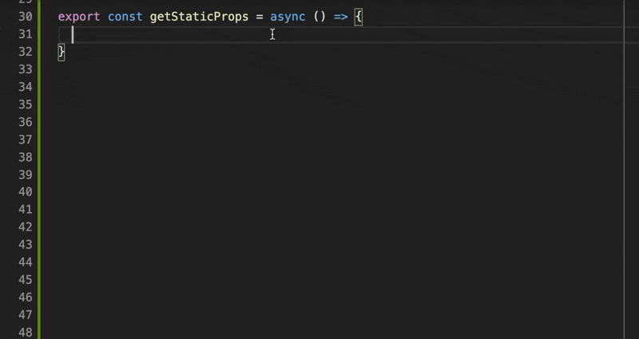

# Sanity Codegen ✨ · [](https://codecov.io/gh/ricokahler/sanity-codegen) [](https://github.com/ricokahler/sanity-codegen/actions) [](https://bundlephobia.com/result?p=sanity-codegen)

> Generate TypeScript types from your Sanity schemas

## [Demos](https://github.com/ricokahler/sanity-codegen#demos)

### [CLI — generate types in seconds](https://github.com/ricokahler/sanity-codegen#cli--generate-types-in-seconds)

CLI handles a babel setup and shims out the Sanity part system to generate TypeScript types with ease.


### [Client — for optimized Sanity DX](https://github.com/ricokahler/sanity-codegen#client-for-optimized-sanity-dx)

Sanity Codegen ships with a simple and tiny client that hooks up with your types.



## Installation

```
npm i --save-dev sanity-codegen prettier
```

or

```
yarn add --dev sanity-codegen prettier
```

> Note: Prettier is a peer dependency

## CLI Usage

Create a `sanity-codegen.config.ts` or `sanity-codegen.config.js` at the root of your project.

```ts
import { SanityCodegenConfig } from 'sanity-codegen';

const config: SanityCodegenConfig = {
  schemaPath: './path/to/your/schema',
  outputPath: './schema.ts',

  // NOTE: The CLI ships with a pre-configured babel config that shims out
  // the Sanity parts system. This babel config does not read from any
  // `.babelrc` or `babel.config.js`. You can only configure extra babel
  // options here.
  // babelOptions: require('./.babelrc.json'), // (optional)
};

export default config;
```

[See here for the rest of the available options.](https://github.com/ricokahler/sanity-codegen/blob/d4eb4a8ac5f6d27f709697ccdbd2a296d1e51dc2/src/generate-types.ts#L97-L121)

Additionally, you can import the [default babel config](https://github.com/ricokahler/sanity-codegen/blob/36e74c3b73bde57e0fbeb913857f98c190407d26/src/cli.ts#L8-L46) from `const { defaultBabelOptions } = require('sanity-codegen/cli')` if you need to merge your current config.

Then run the CLI with [`npx`](https://github.com/npm/npx) at the root of your sanity project.

```
npx sanity-codegen
```

> Running with `npx` runs the CLI in the context of your project's node_modules.

## Client

The Sanity Codegen client is a very simple Sanity client that utilizes the generated types for great DX.

Create `sanity-client.ts` file and configure and export the client.

### Client Installation

```ts
// sanity-client.ts
import { createClient } from 'sanity-codegen';
import { Documents } from './your-generated-schema-types.ts';

// This type parameter enables the client to be aware of your generated types
//                           👇👇👇
export default createClient<Documents>({
  // Note: these are useful to pull from environment variables
  // (required) your sanity project id
  projectId: '...',
  // (required) your sanity dataset
  dataset: '...',
  // (required) the fetch implementation to use
  fetch: window.fetch,
  //
  // (optional) if true, the client will prefer drafts over the published versions
  previewMode: true,
  // (optional) only required if your dataset is private or if you want to use preview mode
  token: '...',
  // by default sanity-codegen caches responses in memory. this can be disabled if desired
  // disabledCache: true,
  //
  // (optional) enables the usage of `apicdn.sanity.io`. this is recommended
  // if you plan on using this in browsers. don't use this with preview mode
  // see here: https://www.sanity.io/docs/api-cdn
  // useCdn: true,
});
```

### Schema Codegen Options

If you want your type to be marked as required instead of optional, add `codegen: { required: true }` to your schema fields:

```ts
export default {
  name: 'myDocument',
  type: 'document',
  fields: [
    {
      name: 'aRequiredField',
      type: 'string',
      // 👇👇👇
      codegen: { required: true },
      validation: (Rule) => Rule.required(),
      // 👆👆👆
    },
  ],
};
```

This will tell the codegen to remove the optional `?` modifier on the field.

> **NOTE:** Drafts that are run through the document may have incorrect types. Be aware of this when using preview mode.

### Client Usage

The client currently only contains 4 methods:

```ts
/**
 * Pass in a document type name and an ID and the client will return the full
 * document typed. Returns `null` if the document can't be found.
 */
function get<T>(type: string, id: string): Promise<T | null>;

/**
 * Pass in a document type and optionally a groq filter clause and the client
 * will return an array of those documents.
 */
function getAll<T>(type: string, filter?: string): Promise<T[]>;

/**
 * Given a Sanity reference, this will fetch that reference with types.
 * Calls the above `get` function internally
 */
function expand<T>(ref: SanityReference<T>): Promise<R>;

/**
 * Passes a query along to sanity. If preview mode is active and a token is
 * present, it will prefer drafts over the published versions. The type must be
 * provided by you.
 */
function query<T = any>(query: string): Promise<T[]>;

/**
 * Clears the in-memory cache. The cache can also be disabled when creating
 * the client
 */
function clearCache(): void;

/**
 * Flip whether or not this client is using preview mode or not. Useful for
 * preview mode within next.js.
 */
function setPreviewMode(previewMode: boolean): void;
```

The design behind the client is to fetch full documents and handle projections and transforms in code.

The appeal of this approach is purely its simplicity, and in the context Jamstack apps the extra weight of the request doesn't matter since it'll get compiled to static data anyway.

### Next.js

If you're using Next.js you can write your projections/transforms in `getStaticProps` and use the return type to infer incoming props. The types will flow down nicely 😎.

```tsx
import sanity from './sanity-client';

export const getStaticProps = async (context) => {
  const slug = context.params?.slug as string;
  const [blogPost] = sanity.getAll('blogPost', `seo.slug.current == "${slug}"`);
  const { title, content } = blogPost;

  return { props: { title, content } };
};

type UnwrapPromise<T> = T extends Promise<infer U> ? U : T;
type Props = UnwrapPromise<ReturnType<typeof getStaticProps>>['props'];

function BlogPost({ title, content }: Props) {
  return (
    <>
      <h1>{title}</h1>
      <p>{content}</p>
    </>
  );
}

export default BlogPost;
```

> 👇👇👇
>
> 👋 Alternatively, I recommend checking out [`next-data-hooks`](https://github.com/ricokahler/next-data-hooks). Types + Sanity Codegen just work with its provided pattern.
>
> 👆👆👆

### Gatsby

If you're using Gatsby, we recommend you follow their guide for using [Gatsby without GraphQL](https://www.gatsbyjs.com/docs/how-to/querying-data/using-gatsby-without-graphql/#the-approach-fetch-data-and-use-gatsbys-createpages-api).

> ⚠️ However note that this solution is not as nice as the Next.js alternative. [Please refer to this issue.](https://github.com/ricokahler/sanity-codegen/issues/31)

## API Usage

Better docs coming soon. For now the gist is:

```ts
import generateTypes from 'sanity-codegen/generate-types';

generateTypes({
  // see here:
  // https://github.com/ricokahler/sanity-codegen/blob/13250d60892bfc95b73d88b28e88b574a31935a7/src/generate-types.ts#L85-L109
}).then((generatedTypes) => {
  // `generatedTypes` is a string with the typescript code
});
```

However you may run into challenges with executing the code if your schema imports from the sanity parts system. [The CLI tries to help you with this.](https://github.com/ricokahler/sanity-codegen/blob/d4eb4a8ac5f6d27f709697ccdbd2a296d1e51dc2/src/cli.ts#L8-L40)
